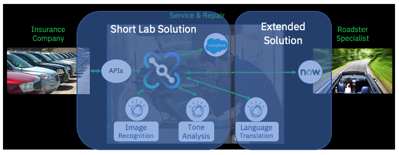

# Cognitive Car Insurance Claims Demo
This set of instructions is a step-by-step guide to running the Cognitive Car Insurance Claims Demo.

You do not need to have expertise in using the Cloud Pak for Integration (CP4I), although previous experience will be useful.

Similarly for using the individual integration capabilities used in this demo: IBM App Connect and IBM API Connect.

## A note on the instructions...
We appreciate that we have different audiences, ranging from 'I just want to get the demo running as fast as possible' to 'I want to use this as a learning exercise and explore all the details'

We've tried to keep the 'end-to-end flow' as simple as possible and provide lots of 'Deeper Dive / More Info / Why did we do this?' links off to the side.

## Demo Scenario
This demo shows you how to easily create an API Led integration using the IBM Cloud Pak for Integration (CP4I).

We will use the low-code/no-code Integration Designer to create an API which takes a car repair claim request, complete with a photograph of the car, and integrates with a SaaS CRM system and IBM’s Watson AI to create a car repair case with all the correct details loaded into the SaaS system and data routed to the correct location based on the image contents; all in a few seconds before returning a response to the customer.

As an ‘extension scenario’ we check if the car is a convertible/roadster.

If it is, we translate the request into Spanish for our Spanish-speaking partner and create an incident in their ServiceNow SaaS system, complete with car photograph.

If you are constrained by time, don't worry - we will ensure we build an end-to-end managed API before discussing the extended scenario.

More details on the scenario are [here](scenaro.md)

The documentation for this demo may look long but don’t be put off by the number of pages: Most of them are filled with screenshots and descriptions– there’s not that much “work” to actually do – we’ve created a lot of things for you to use ready-to-go.

Let’s get going and create the demo!

## List of Ingredients / Things you will need
If you already have these, skip right on! Otherwise expand the links to find out how to get them...

An Instance of IBM Cloud Pak for Integration (CP4I)

You'll need version 2020.2.1 or later.
  
You can run CP4I on the IBM cloud, on another cloud of your choice (e.g. AWS, Azure, GCP), on the Redhat Marketplace or on your own infrastructure.
  
If you need to get an instance of CP4I to run this demo, see [here](../../Docs/Environments/README.md)

An eMail server and client

You will need a mail server (SMTP server) as this is required by IBM API Connect.

IBM API Connect uses email to send invitations to onboard user accounts and to reset passwords etc. We will need to send emails when we register new API consumers to send them account activation details.

Normally we’d use our enterprise’s SMTP (email) server to send the emails and then receive them into the appropriate accounts using mail client software and inboxes.

If you do have an SMTP email server and accounts you’d like to use, that’s fine: But as eMail servers can be used either intentionally or unintentionally to send excess mail, we’re going to suggest you use https://mailtrap.io for both.

For more details of how to set up a mailtrap account see [here](../../Docs/Environments/README.md)

A (free developer) instance of Salesforce

Salesforce is a CRM system provided as a SaaS i.e. it is hosted in the cloud.  

In this scenario, we as a car repair company will use Salesforce to create and store our car repair claims.  

Salesforce allows you to create developer instances/accounts free of charge. You will need a developer account to run this lab so instructions as to how to create them are included and you can set an account up as part of the lab. If you already have a developer Salesforce account, you can use that.
 
For details of how to create a free developer instance of SalesForce, click <a href="../../Docs/connectors/SalesForce/README.md">Here</a>. This section also has details of how to set up a CP4I connector to SalesForce.

A (free lite plan) instance of IBM Watson Visual Recognition

IBM Watson is available on the IBM Cloud and also in the IBM Cloud Pak for Data. IBM Cloud lets you create non-expiring free instances of the IBM Watson services that you can use for this demo (or anything else)
  
The IBM Watson Image Recognition service lets you send a picture (.jpg, .png) to Watson and returns a list of things that Watson can ‘see’.
  
in our case, we will use Watson to check if there is a car in the picture and, in the extended version,  if it is a convertible/roadster car or not. If it’s a roadster, we’ll send it to our partners. If it’s not, we’ll repair it ourselves. If there’s no car in the photo, we’ll send it back and let our customer know.
  
For details of how to create a free developer instance of IBM Watson Visual Recognition, click <a href="../../Docs/Connectors/WatsonVisualRecognition/README.md">Here</a>. This section also has details of how to set up a CP4I connector to the Watson Visual Recognition Service.

A (free lite plan) instance of IBM Watson Tone Analysis

IBM Watson can tell if someone is happy or sad or angry or many other emotions!
  
If your customer is angry, you want to know so you can make them happy – we’ll use this to look at the customer’s description of the damage/problem and put the tone into our Salesforce case so that when we call them, we know what to expect.
  
For details of how to create a free developer instance of IBM Watson Tone Analyzer, click <a href="../../Docs/Connectors/WatsonToneAnalyzer/README.md">Here</a>. This section also has details of how to set up a CP4I connector to the Watson Tone Analyzer Service.

 
For the 'Extension' Scenario:

A (free developer) instance of ServiceNow

ServiceNow is an incident management system which is provided as a SaaS on the cloud. Our repair partner which repairs convertible/droptop cars uses this system to manage their repairs.
  
ServiceNow allows you to create free developer instances as well – you will need one to extend this demo.
  
For details of how to create a free developer instance of ServiceNow click <a href="../../Docs/Connectors/ServiceNow/README.md">Here</a>. This section also has details of how to set up a CP4I connector to connect to your ServiceNow developer Instance.

## CP4I Capabilities Used in this demo:
The Cloud Pak for Integration contains components and capabilities to implement multiple integration patterns – we won’t be using all of them in this demo.

We will be using the secure gateway (DataPower) to secure our APIs as part of API Management but we will not be using messaging (MQ), event streaming/Kafka or the high-speed Data Transfer (Aspera) in this demo.

These capabilities are all included in CP4I and there are other labs and demos available to help you explore these.

We will use the following CP4I capabilities in this demo:

### Application Integration (IBM App Connect):
IBM App connect provides a low-code/no code integration capability with a large number of pre-built connectors to connect to a variety of different endpoints.

We will use this to create the API contract with a simple model and then the integration flow API Implementation that is started with our API call and which contains all the integration logic and data transformation.

### Smart Connectors
These connectors contain everything needed to connect to the systems and endpoints – we just need to give them the endpoint location and credentials.

We will use one connector each for:
* SalesForce
* Watson Image Recognition
* Watson Tone Analysis.

For the extended version:
*	Watson Language Translation
* ServiceNow

### API Management (IBM API Connect)
Once we have our integration API built, we need to expose it securely to the outside world via an API gateway.

We also need to be able to create a self-service portal to allow consumers to discover out APIs and sign up to use them.

We also need to create rate plans to limit how many times the API can be called.

We will push our API from the Application integration capability directly into the API Management capability where the API Product and API artefacts we need will be created for us automatically.

We will then add security and rate limiting plans and publish our API to our secure gateway and portal.

## Solution-Flow Breakdown: ‘Short’ version of the solution
*	Receive the Customer’s car repair request including their photograph via an API
*	Use IBM Watson Image Recognition to analyze the photo. If it is not a valid picture, Watson will return an error immediately to the user calling the API.
*	Check that Watson can ‘see’ a car in the picture – if not, we will immediately respond back with an error saying ‘There is no car in this picture’ so the error can be corrected immediately.
*	Create a ‘Case’ in Salesforce with the data from the API. This Case is where we store the details and progress of our repair.
*	Analyze the description of the problem as described by the customer using IBM Watson Tone Analysis. We store this in Salesforce for future reference – if the customer is angry or upset, we may wish to take further action or treat them more carefully.
*	Add an attachment of the photograph to Salesforce so that we have the image stored in our system.
*	Send a response back to the customer with their Salesforce case reference for future enquiries and also an estimate of how long it will take to repair and how much it will cost (These are hard coded in this lab – in the extension, it is more expensive to repair a roadster for example)

## Scenario Flow Breakdown ‘Extended’ version
(We will not build these steps in detail in the demo, but guidance and artefacts will be provided at the end if you wish to try it and you have time)
*	When Watson analyzed the image, look to see if a ‘Roadster’ (or convertible) car was detected in the image.
*	If so, we will send it to our partner for repair. Our partner uses ServiceNow, not Salesforce so we need to create an incident in their ServiceNow system – automatically
*	Our partner speaks Spanish and we don’t: No problem, we will use IBM Watson language translator to translate our request into Spanish before we send it to them
*	We will also create an attachment of the car photo into their ServiceNow system.

# Plan of Work
This solution has a number of moving parts, so we’ll tackle them in a logical sequence. If you’re familiar with how to do any of the steps, feel free to do them in the way you prefer or are familiar with.

If you’re familiar with any of the tools we’re using, feel free to embellish or change the lab – as long as you make sure it all ‘hangs together’. You can build the ‘extension’ version if you’re familiar with the tooling.

We recommend you make one journey through the lab as we describe it and then go back and explore if you have time. You can make changes and redeploy new versions afterwards.

We’ll be doing the following:
### Set up our integration systems and services endpoints [(Shortcut Link)](settingUpEndpoints.md)
We are going to integrate with SaaS systems and IBM Watson AI services.

We will need to have these endpoints created and create credentials for so that we can integrate to them securely in the lab.

In the ‘real world’ systems like Salesforce or ServiceNow will be running at customers already – creating instances of them is a demo-only task.

### Create an integration flow for our ‘Car Repair Claim API’ [(Shortcut Link)](creatingTheIntegrationFlow.md)
This will create our API and the integrations to all of our endpoints.

We will create an ‘integration flow’ which takes the API request, calls the endpoints in the correct order, maps the data between them and sends an appropriate API response back to the caller.
### Deploy the API to the Cloud Pak for Integration (CP4I) runtime [(Shortcut Link)](deployAPIToRuntime.md)
Once we have developed our flow and tested it, we will deploy it to CP4I running on OpenShift.

This will create a Kubernetes container/pod deployment with three highly available replicas which we can then scale up and down as we wish. (we will not show scaling in the lab but it will work if you want to try it)
### Manage the API, applying security and rate-plans and publish it to our Self-Service Portal [(Shortcut Link)](manageTheAPI.md)
An API is no use if our consumers/consumers can’t discover it, get the information they need to use it and preferably sign up for access in a self-service manner.

Once they have access to our API, we need to make sure that the API is secured using API keys and is rate-limited using API plans.
### Create an ‘application’ to consume our API. We’ll use the portal to discover the API and self-service register it. [(Shortcut Link)](consumeTheAPI.md)
Whilst we won’t be building an actual application to test our API, what we will be doing is showing how applications are registered to our API server.

Registering Applications allows us to assign API keys and also to monitor the calls made to the API by that application

# Next Steps: Setting up the endpoints:
Click [Here](settingUpEndpoints.md) to proceed
