# Cognitive Car Insurance Claims Demo - Detailed Flow Walkthrough
This section is a detailed walkthrough of the API flow, step by step looking at all of the nodes and how the flow is constructed.

We'll step logically through the flow describing each step via the business logic we want to implement.
### 1. Receive the Customer’s car repair request with photograph via an API
Designer automatically creates an API “Request” and “Response” node for your API flow.

Click on the `Request` node:
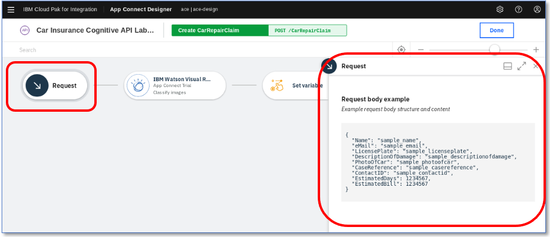
Note how the request body is created from the model – and sample data is automatically generated. When building an API, there is literally nothing to do here – it’s done for you.

### 2. Use IBM Watson Image Recognition to analyse the photo
If it is not a valid picture, Watson will return an error immediately to the user calling the API.
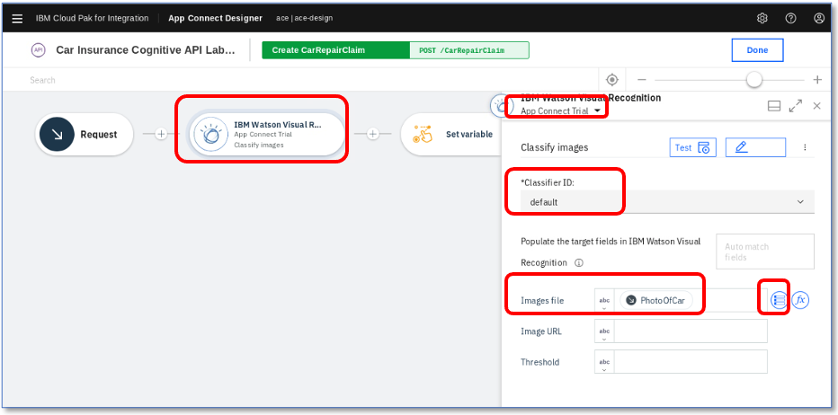
We use the built-in Watson Visual Recognition connector that we configured earlier. Note that we selected `App Connect Trial` account here. If you had it named incorrectly (e.g. `Account 1`) then you would have an error. To fix it, change to `App Connect Trial` in the pull down.

The `Classifier ID` is to tell Watson which image training data set, or classifier it should use. You can train Watson with your own image data e.g. for products your company sells or assets it uses. If you create a custom classifier, the connector will go and find it and offer it to you in a drop-down. We will use the default ‘out of the box’ classifier.

We only need one ‘target field’ to populate – our images file. This is our base64 string with the photo in it.

Designer doesn’t have ‘Mapping Nodes’ – it’s inspired by spreadsheets where you concentrate on what data you want to put in a cell, rather than where source data needs to be mapped to. All of the fields that have been populated in the flow from variables, requests or connectors are automatically stored and are available for you to use at any time.

You can see that we’ve mapped our `PhotoOfCar` field from our request. You can tell it’s from the request because it has the same icon as the request node next to it!

Click the hamburger (three lines) pull down button next to the field:
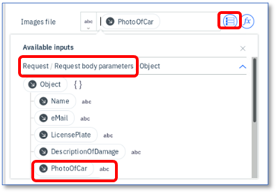
All of the fields that are in the flow so far are available – just click on the one you want. This is how ‘mapping’ is done in designer – it’s like filling in cells in a spreadsheet.

Make sure `PhotoOfCar` is selected (or don’t change it) before you move on.

### 3. Check that Watson can ‘see’ a car in the picture
Watson will return a list of what it thinks it can see in a picture, each with a confidence rating.

For example, for one of our test pictures, we will use a picture of a Subaru SUV. If we ask Watson to look at this, we see the following – it’s .81 (81%) confident it can see a car in the picture.

Note the ‘classes’ that Watson returns – these are the same classes that we will be using in our flow.
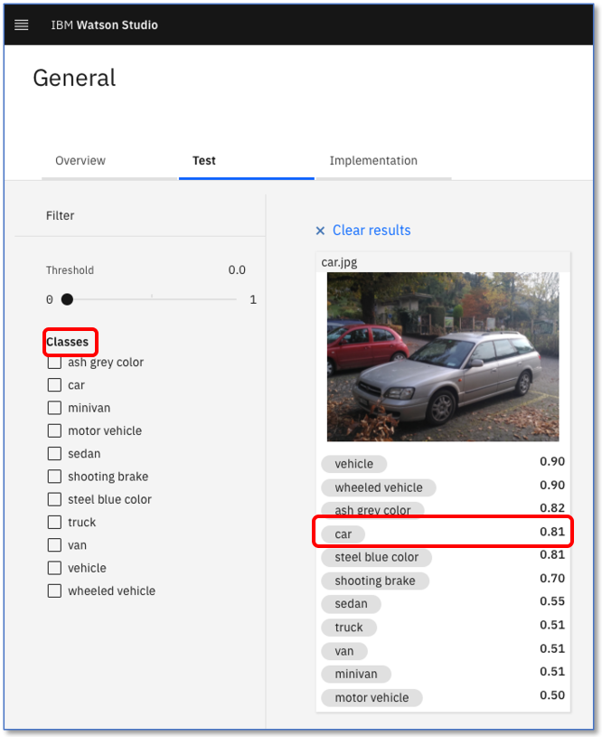
(This screenshot is from Watson Studio – Available for free in the IBM Cloud – search for it and you can try it yourself with your cloud account and your Visual Recognition Service instance)

We’re going to set variables to check for three things:
*	Is there a car in the image? `ImageCar`
*	Is there a person in the image? `imagePerson`
*	Is there a roadster (convertible) car in the image – this is for the extension lab, but we have the logic here anyway. `imageRoadster`

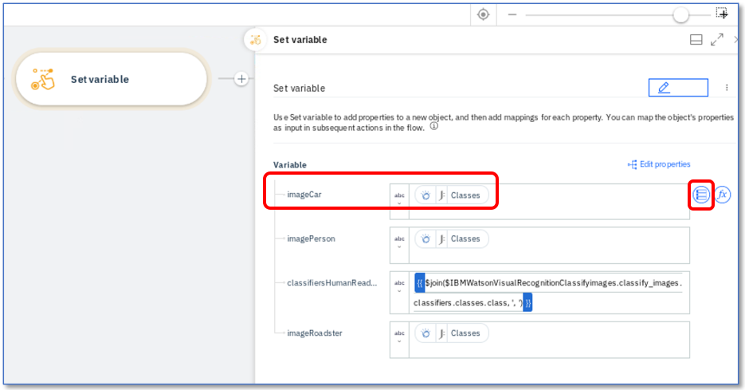
Let’s look at ‘is there a car?’ – `imageCar`
Click on the menu on the right, then expand `IBM Watson Visual Recognition`

The `Available Inputs` menu appears. You can see we now have fields from both the request and IBM Watson Visual Recognition.

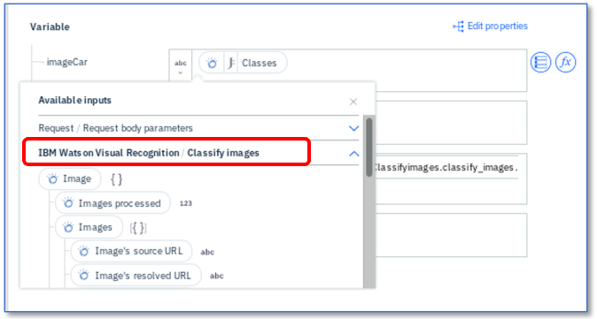
If you scroll down, you’ll see we get down to `Image->Images[]->Classifiers[]->Classes[]->Class name` (together with the Score)
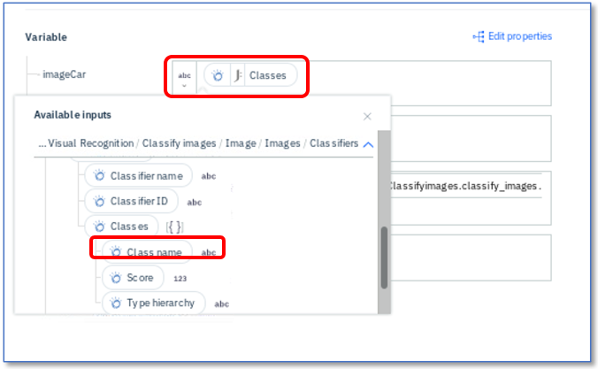
What does this mean?

It means Watson has returned an `Image` object.
* In the `Image` object is a list (array) of images (we denote this using ``[]``)
* In each `image` (they may be more than one) there is a list(array) of `Classifiers` (Watson training)
* In each `Classifier`, there is a list(array) of `Classes`. This is what Watson 'sees'. e.g. `Car`
* In the `Class`, there is a `class name` and a `score` – amongst other things.

In all of that, we need to say ‘Hey Watson – thanks for the data: Can you see a car?’ Normally we’d end up coding loops around arrays and if/thens to find it…

App Connect does it by using a formula – just like a spreadsheet.
Close the pull-down and click on the `Classes` bubble in the `imageCar` field. Click `Edit expression`
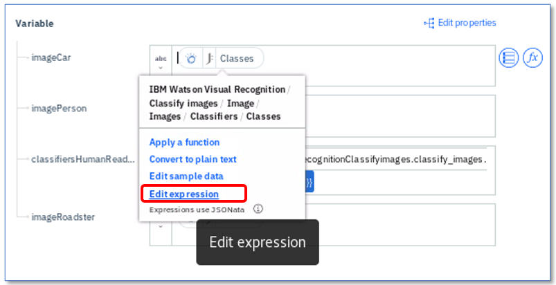
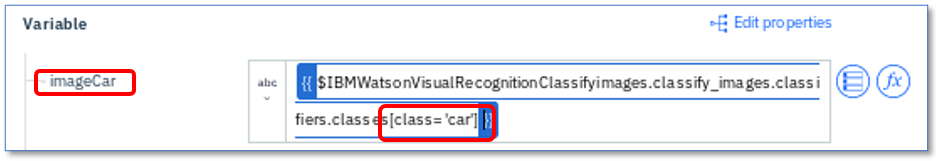
What we did is click on the hierarchy pull down to build a query that looks like this:
``$IBMWatsonVisualRecognitionClassifyimages.classify_images.classifiers.classes[class=’car’]``
(we had to manually add the ``[class=’car’]`` part at the end)

All this does is go down the hierarchy, each level separated by dots and then has a select query at the end ``[class=’car’]`` to give us all the entries where the class is a car.

App Connect automatically scans through the entire hierarchy, sorting out things like arrays/lists and objects and lets us get straight to the data we want.

We use the same approach  to populate `imagePerson` using ``[class=’car’]`` and `imageRoadster` ``[class=’roadster’]``.

If you want to more easily see the query expression, then hover over the `classes` bubble e.g. here:

All mapping is done the same way - for example, we want a string that joins (concatenates) all of the classes (things that Watson can see) together, separated by commas so it’s Human Readable. For this we use `apply a function` and select `Join` from `String functions`, just like building a spreadsheet formula.

To get the ‘dot hierarchy’, just use the pull down variable explorer. Pick the field you want and the choose `Apply a function`

e.g. ``$join($IBMWatsonVisualRecognitionClassifyimages.classify_images.classifiers.classes.class, ', ')``
Note that App Connect joins all the classes together in one go – no 'for' loops, building up strings etc. It’s a different way of looking at mapping.

All of this mapping uses a language called JSONata – more details here https://jsonata.org

### 4. If there is no car found, we will immediately respond back with an error saying ‘There is no car in this picture’
We now know if there is a car or not in our image…if there is no car image (i.e. if `imageCar` is empty) we want to send back an error.

We use an App Connect `If` node to visually show us our logic:
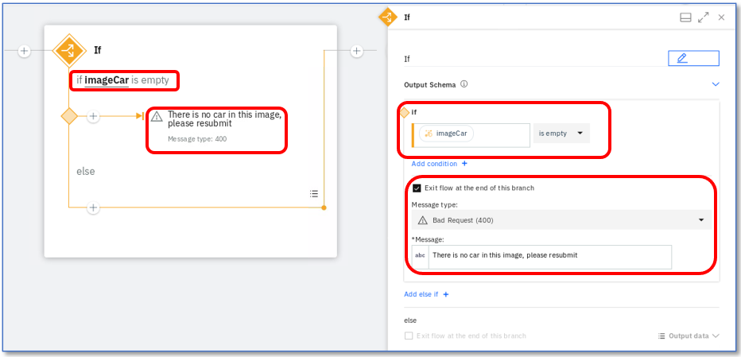
We visually create an ‘If imagecar is empty’ check. If it is empty, we send a ‘bad request’ response – note that we don’t need to remember that in REST APIs, ‘Bad Request’ is ‘HTTP 400’ – App Connect knows this – just pull the response from the drop down.

We also add a ‘There is no car in this image, please resubmit’ error.

### 5. Create a ‘Case’ in Salesforce with the data from the API.
This Case is where we store the details and progress of our repair.

We’ve already connected to Salesforce, so we can use the Salesforce connector.

We want to add a contact for this case, but we need the contact ID from Salesforce, not the name when we create the case.

This is a very common integration issue – systems need IDs and not names. No problem, sorting this is simple in Designer!

Click on `Retrieve Contacts`
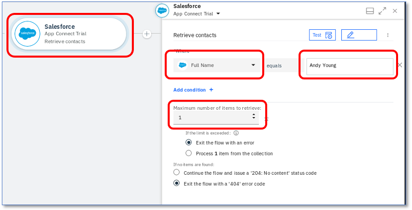
We’re going to use 'Andy Young’ as our contact – he’s the contact for the insurance company that sends customers. Salesforce Developer Accounts have a pre-populated set of data that you can use to test. ‘Andy Young’ is one of those pre-populated contacts. We will hard-code his name for speed in this demo.

But how do we know exactly what ‘Full Name’ means? Does it have ‘Mr?’ in it? Is it ‘Andy’ or ‘Andrew’? Do we need his middle name?

Change the name to `Andrew Young` and we’ll find out. Note that App Connect gives you the field description to help you out. If you add any expressions such as ``$uppercase(Full Name)`` then the preview (next to the eye) shows you what your field will look like after your expression.
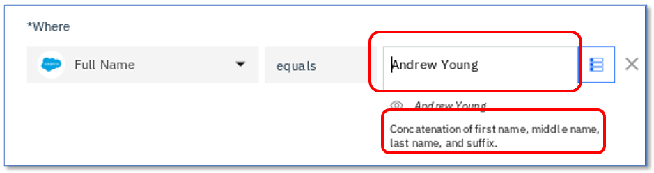
Now click the `Test` button
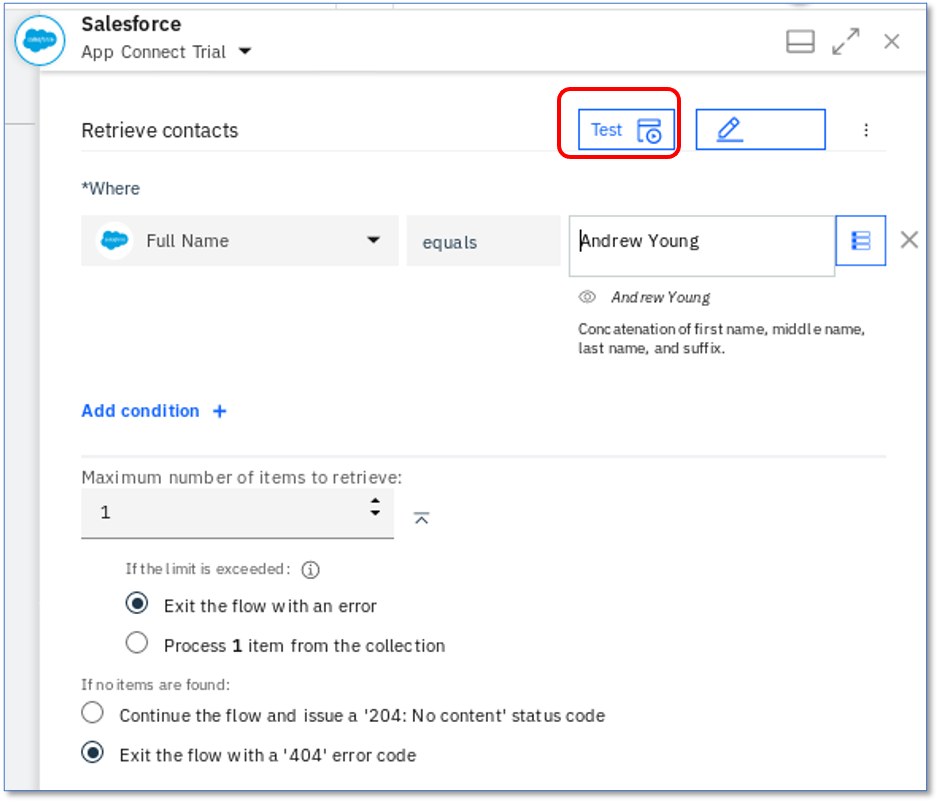
We can go straight off to SalesForce to check! App Connect calls the SalesForce connector right in the flow editor and we get a `Failed 404 Not Found` error:
Click `View details`
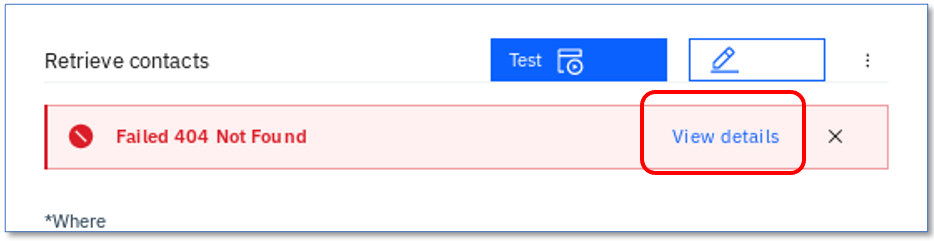
And then we can see the reason - Salesforce returns `No Documents found` - which is what we'd expect (as we know it's 'Andy Young' not 'Andrew Young')
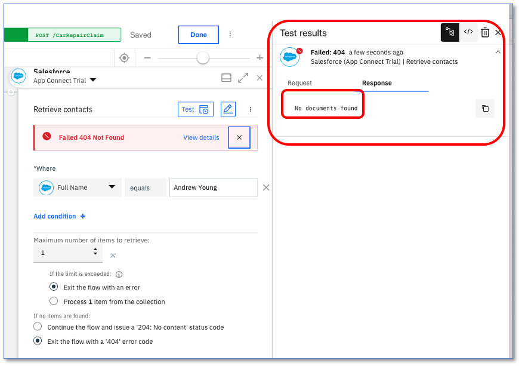
You can see the request as well as the response in App Connect -click `request`
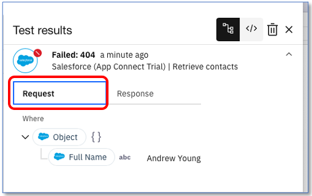
OK, let’s put the field back to `Andy Young` and try clicking `Test` again:
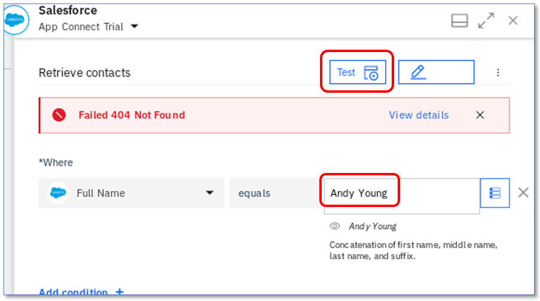
Success! Hooray, let’s check our result! Click `View details`
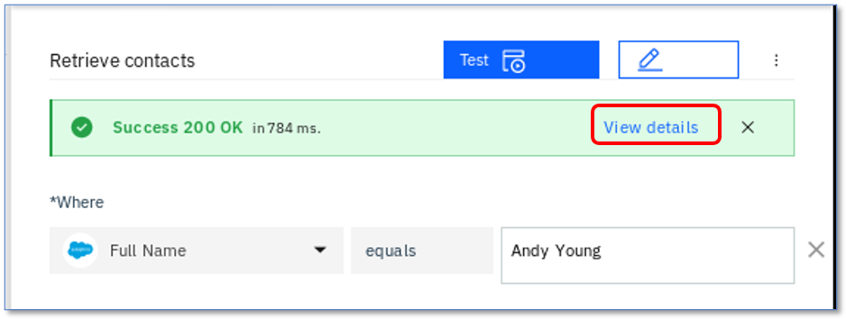
And we can see the successful result:
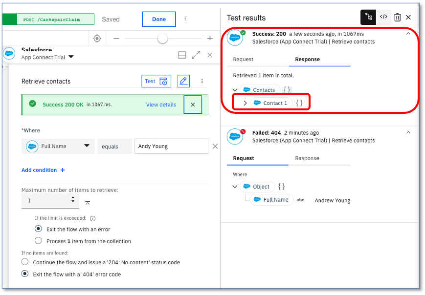
There’s our test results, right in the tooling, right from the real system in the cloud. This works with all of the connectors such as Watson in our flows here. It’s a great way of checking your integration calls work the way you want them to without having to test the whole flow.

To further check your results, click on `Contacts/Contact1` and you’ll see:
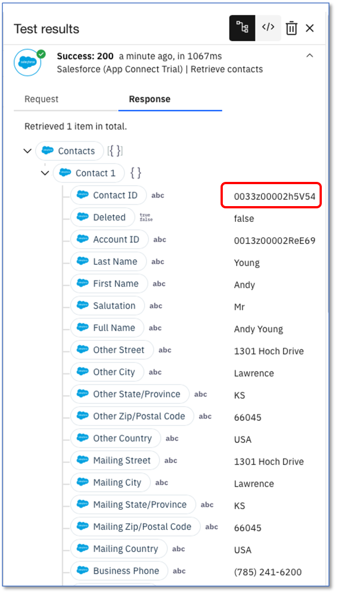
All of the data back from Salesforce – in the same format you use to ‘map’ fields - ready to be used, right in the Designer.

Now we have the ID that we need, let’s create our Salesforce case. Click on the `Salesforce – Create case` node. Note that we just re-use the same connector but with a different operation and data.
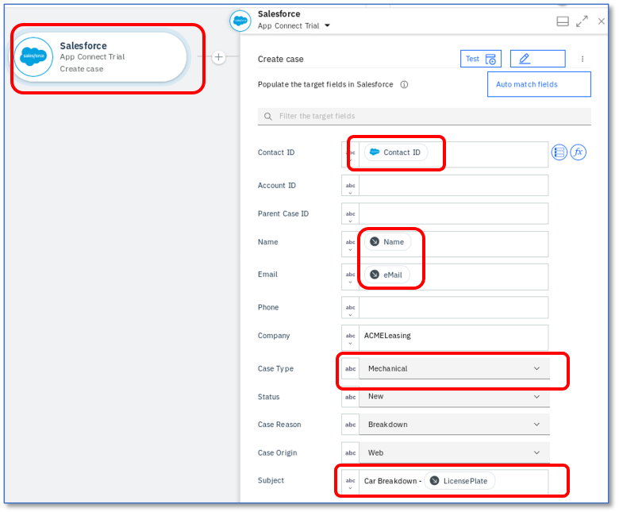
Note that we can see that our contact ID comes from the previous `retrieve contact` SalesForce Call. The Name and email come from the API Request.

The connector ‘knows’ that fields like `Case Type` have a limited number of values in Salesforce – so it automatically converts them into pull-down lists of values for you to choose from.

Also our subject. It’s like a spreadsheet – we just type in what we want. No 'concatenation' code, no adding strings together, no string appenders: Just type what you need.

### 6. Add the photograph to our Salesforce case so we have it stored
To add a photograph, we need to create a salesforce attachment – that’s easy, just use the SalesForce connector again.

Click on `Create Attachment`
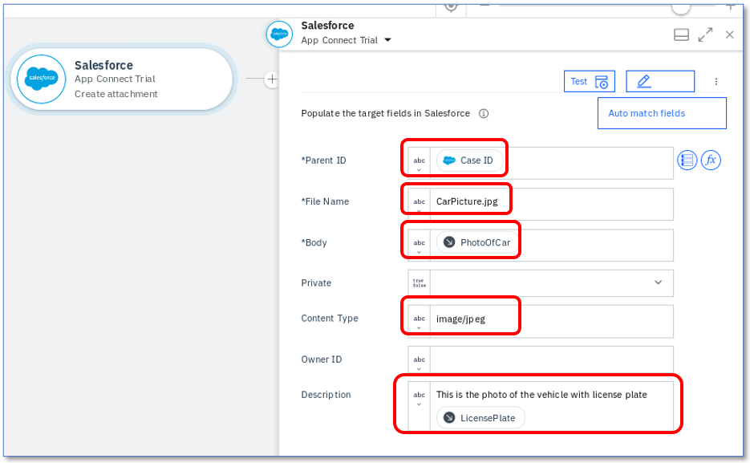
Note that we use the `Case ID` that is a returned value from the `Create Case` connector call – it’s been kept in the flow automatically. We send the `PhotoOfCar` as a `base64` string and we tell Salesforce that the content Type is `image/jpeg`.
### 7. Analyse the description of the problem as described by the customer using IBM Watson Tone Analysis.
We store this in Salesforce for future reference – if the customer is angry or upset, we may wish to take further action or treat them more carefully.

First we’ll use the Watson Tone Analyzer; Click on `Get tone analysis`
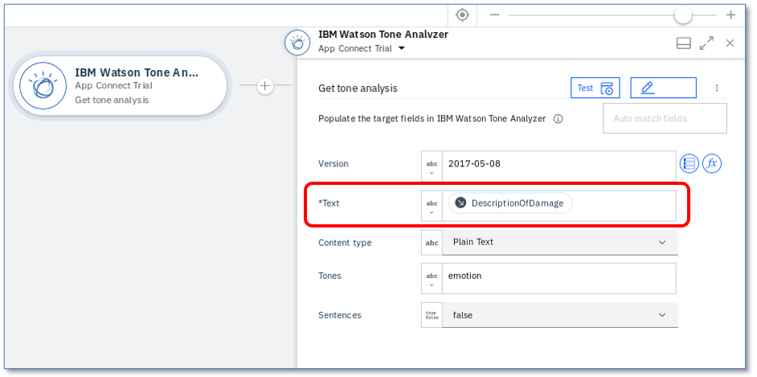
You can see that we've just mapped `DescriptionOfDamage` into the `Text` field before we call the Tone Analyzer.

We'll get the Tone name result back. We don't need to use a 'response' variable or anything - that's all done for us.

Next, we’ll add a comment to the case with the Salesforce connector and give it the tone name we got from Watson.
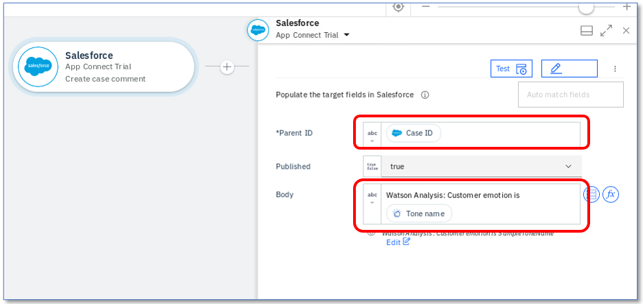

### 8 Finally, Send a response back to the customer with their Salesforce case reference
For future enquiries and also an estimate of how long it will take to repair and how much it will cost (These are hard coded in this demo for simplicity)

Click on the `Response` node – we just fill in the values we want, like all the others. Note also that the `Response` node knows the correct HTTP response for `create/POST` - which is `201` (note - *not* 200 for create/POST!)
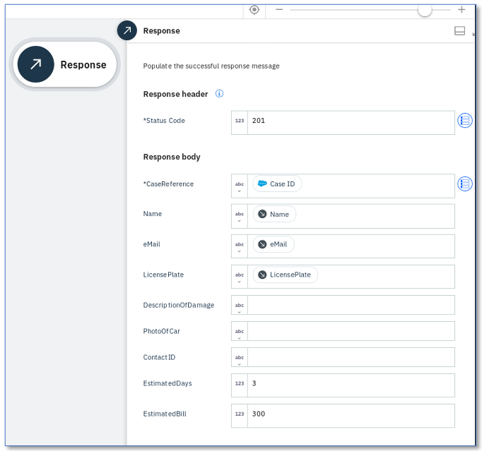
Click `Done` we’ve built the flow – let’s start it!
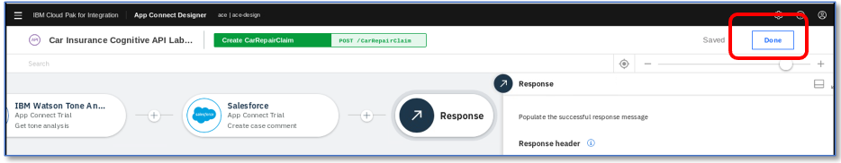

### Next steps
The next thing we need to do is start the flow and test it - click [here](startingTheFlow.md)
