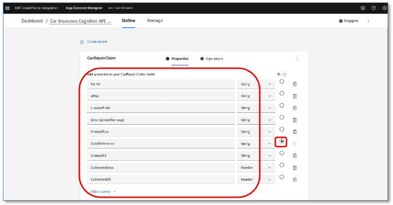
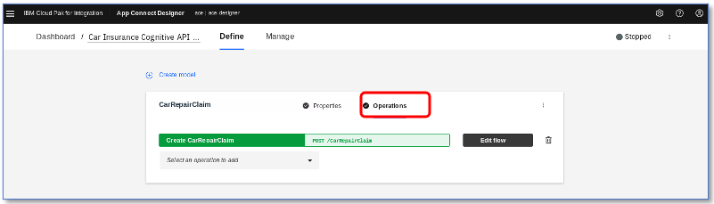
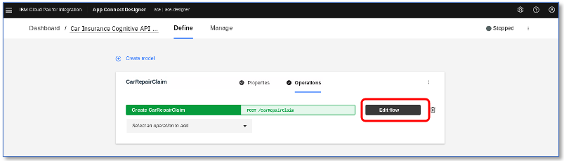
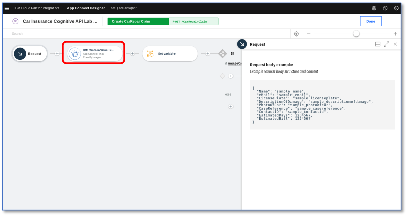
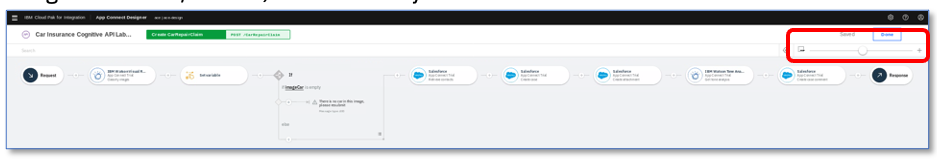

# Cognitive Car Insurance Claims Demo - Reviewing the Integration Flow
After importing the Car Insurance Cognitive API Lab Short flow from the Asset Repository, you should now see our flow API open in the designer.

##Reviewing the API Data Model

What you can see  first is our API model.

App Connect Designer builds your API for you – you don’t need to worry about OpenAPI specs or Swagger editors – it’s all built in. To create your API, you just type in the names of the fields you want to use in plain English. If you want, you can use objects for complex structures but we won’t here

These are the fields we are going to use for our API – we’ve created them as part of the asset to save you time. You can rename them if you wish but if you do, our test scripts for the APIs won’t match – or work, so leave them as they are for now.

Note that we tell our API which field is the key – in our case, CaseReference. When creating RESTful APIs, they should be resource based and each resource should have a unique key.

CP4I Designer bakes in good REST API creation right into the tooling so you don’t need to worry too much about it.

Note that the `PhotoOfCar` property is a string – our consumers will pass the photo data in as a string of base64 encoded text. This is one way of passing a binary image to an API.

Now that we’ve told the API what data to use, we need to define what actions to perform on that data.

For this lab, we’ve defined our `CarRepairClaim` data model. We have data fields – what do we want to do with them?

Now we want to do a ‘Create Car Repair Claim’ operation.

Click `Operations` – operations are the actions that the API exposes with the data.

We can have multiple operations in one API – such as ‘Create’ ‘Retrieve’ ‘Update’ etc.

The tooling auto-generates good REST for you, translating into HTTP verbs like GET and POST automatically. You don’t need to know REST to build APIs with CP4I – the knowledge you need is built in.

For example, look how a pull-down menu auto generates the HTTP ‘POST’ and the path of `/carrepairclaim`.

In this demo, we’re going to build just one operation – you can add more if you wish.

##Reviewing the API Flow Structure

We’re going to go into the flow logic – click `Edit Flow`

You’ll now see the flow in the designer flow editor here:

See the ‘App Connect Trial’ account name on the IBM Watson Visual Recognition? That’s the reason we had to get the account name correct earlier so it matched.

Scroll through all of the connectors in the flow (use the scroll bar at the bottom) and make sure there are no red dots anywhere.

App Connect Designer connects to the endpoint service every time you open the flow to see if there is updated metadata (this is why you can see spinners when you open the flow). This means the services need to be connected correctly. If there is an issue, there will be a red dot on the connector node.

The most likely reason for a red dot is that your connector account name does not match the name of the account used in the flow. To fix this, go back and rename it in the connector (click the cogwheel at the top right and click ‘Catalog’ to get back to it).

You could rename the accounts in the flow if you wish, but that might make the lab harder to follow: App Connect doesn’t really mind what the accounts are called as long as the references all match.

Using the zoom in/out bar, we’ve shown you the entire flow below:

Or two readable chunks!

You can see that the flow visually matches the logic we defined at the start. Let’s step through.

 Now you've seen the flow, you may want to skip the step-by-step walkthrough - that's fine! Just go direct to ['Starting the Flow'](startingTheFlow.md)

## Next steps
Review the Flow Steps in Detail [here](detailedFlowWalkthrough.md)
