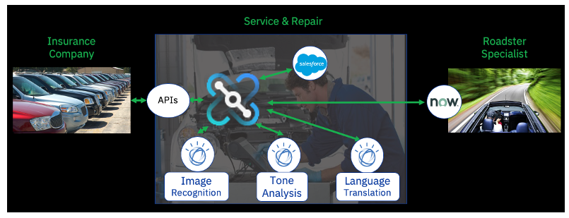

# Cognitive Car Insurance Claims Demo - Scenario Details

## Business Scenario
We are a Car Repair company: We take in vehicles with problems and repair them – seems simple but..

*	We want to gain business advantage by allowing multiple car leasing companies to use us to repair their cars – these companies insist that we expose APIs for them to call to do business with them.

*	We want to allow their customers to book their cars in for repair and get an estimate for price and number of days in real time – in seconds. Later we will build more APIs to allow customers to query the status of their repairs, or make updates or add comments to their repair cases.

*	We want to allow them to send photos of their cars so we can check for type, damage etc.

*	We want to check for errors and issues up-front as quickly as possible to feed back to the customer in real time. Photo not valid? No car in the photo? We’ll tell you instantly so you can re-submit.

* We want to minimize manual processes and have the repair request automatically create a repair case in our CRM system (Salesforce). If a customer wants to book a repair at 3am on a Sunday, they can – it’s their choice.

*	(Extension scenario): If the car is a convertible/roadster, we don’t repair it, it’s a specialist job. We want convertibles to automatically create a repair case in our partner’s system (ServiceNow) as well.

*	(Extension scenario)Our partner speaks Spanish – we don’t! We need the requests translating from English.

*	We are wanting to grow our business fast with this new model and expect the use of APIs to really increase the number of requests we get. We need our solution to be scalable and highly available.

The diagram below shows how all the parties of our business are related:

## Our API-Led Solution
We want to create an API which enables customers to send us photos of their cars along with descriptions of what needs to be done and their details such as their name, email and car license plate.

The picture below shows what we would like to build:

There is a video showing how this whole scenario is built end-to-end on YouTube here: https://www.youtube.com/watch?v=TRzO26kawu4 .It’s about 8 minutes long and might be worth watching to see the whole thing in action and what we are aiming to do.

In this lab, we are going to build a shorter version of this which includes the IBM Watson Image Recognition, IBM Watson Tone Analysis and the Salesforce integration.

We will not use the ServiceNow integration or language translation in the ‘Short’ version of the scenario.

Instructions (and artefacts) to help you extend this to the longer ‘extension’ version will be given at the end but we will focus on getting something working end-to-end as easily as possible to show you the flow.
