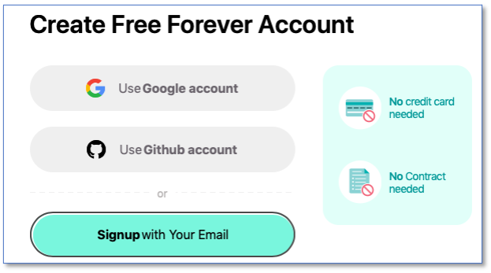
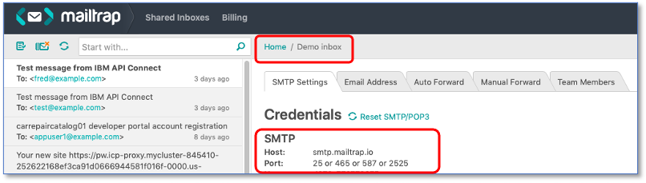

# Setting up an eMail Server and Client for use with CP4I
For some of the demos, CP4I and specifically the API Connect component requires an email server to be able to send emails.

IBM API Connect uses email to send invitations to onboard user accounts and to reset passwords etc. We will need to send emails when we register new API consumers to send them account activation details.

Normally we’d use our enterprise’s SMTP (email) server to send the emails and then receive them into the appropriate accounts using mail client software and inboxes.

If you do have an SMTP email server and accounts you’d like to use, that’s fine: But as eMail servers can be used either intentionally or unintentionally to send excess mail, we’re going to suggest you use https://mailtrap.io for both.

Mailtrap.io is a free cloud service that allows us to ‘pretend to send’ emails to anybody via SMTP  – but they never actually go anywhere. It’s quick and simple to set up a mailtrap account to use at https://mailtrap.io

(Note that this is just a suggestion to give us email capability for the demos – the use of mailtrap.io in conjunction with CP4I is in no way a formal recommendation and you can use whatever SMTP servers and mail client you are comfortable with)

What happens is that mailtrap.io provides both an SMTP email server and an associated “inbox”. It keeps all the emails that we “send” and displays them it in an inbox so that we can see it. This way we don’t need a mail server, email clients, multiple mail addresses and accounts to worry about.

If you have a mail/SMTP server you’d like to use, go ahead and configure it - the demos will work with any SMTP server. If not, we’d suggest using mailtrap.io for the demos.

This gives you both a mail server and an inbox bound into one. Any mail you send via their server gets ‘trapped’ and put into an inbox, allowing you to read it. This is exactly what we want to do!

## Setting up a Mailtrap.io server
Go to http://mailtrap.io
and sign up for an account – it’s instant and free.

Click ‘Sign up”
And ‘Sign up with your email’ – you can use a disposable account e.g. Gmail if you wish, or sign in with github or Google.

When you have your account setup – you’ll get an Inbox. Mailtrap.io acts as both a server and an inbox – really handy for what we want to do. If we sent an email to anyone at any address using the mailtrap server, it will show up in the inbox!

Click into your mailtrap.io inbox and click ‘SMTP Settings’ on the tabs – you’ll see all of the SMTP Credentials you’ll need to setup the CP4I eMail server when you install it.
(Note, use the SMTP credentials, not the POP3 ones)

You’ll need the `user Id` and `Password` from mailtrap when running the 1-click install.

The 1-click install will default the rest of the mailtrap.io settings for you.

## Summary
You now have a working email SMTP server and a webmail client to use with it. You also have the credentials you need to configure CP4I to communicate with it.
