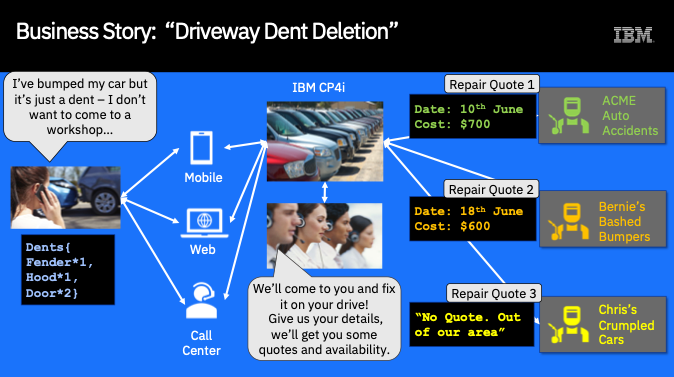
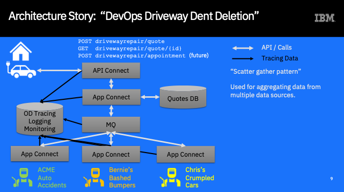

# Driveway Dent Deletion Scenario details
## Business Scenario
The business scenario for this demo is a common one where a user wishes to enter a request for a service or product and have multiple quotes for that service returned from different vendors so that they can choose which one is best for them.

It might not be a case of “I’ll take the cheapest” as that may  not be available quickly enough, in the right colour, or at the right time. For example when requesting quotes to fly from New York to Los Angeles, a direct flight may be more expensive than a stop over: Whether it is worth the extra money to fly direct is up to the user.

Our scenario concerns someone who has incurred minor damage to their car – it’s not serious, more of a small dent. They want it repaired at home, on their driveway by a mobile repairer.

They use an app to get some quotes from three repair companies. They provide their name, eMail, License Plate, State and the number of dents in each part of their car.

Each company provides a quote for the repair and the earliest date that they could perform the repair. These quotes are returned to the user but also stored in a database so that the user can retrieve them for future reference.

In a real-world application, we could have the user accepting the quote, changing their appointment time etc, all through the API. In this demo, we supply the source for all of the artefacts so you can extend the scenario if you wish.

## Demo Architecture
We will use the following components for this demo:

We will create an API which will expose two REST Operations: One to request a quote and one to retrieve a previous quote based on the quote ID.

When the user calls the API to get a quote using the POST operation, an App Connect API integration flow will request quotes for the repair from three different providers:
* ACME Auto Accidents
* Bernie’s Bashed Bumpers
* Chris’s Crumpled Cars

(We deliberately chose unisex names Bernadette/Bernard, Christine/Christopher – it’s really just to get repairers with Initials of A, B and C!)

Each of the three companies will return a quote, which will get aggregated by the flow, stored in the database and then returned to the user, using a reference quoteID

After requesting a quote, the user can then retrieve the quote again if they wish using the GET operation and the quote ID. At this point the App Connect API flow just retrieves the quote from the database.
