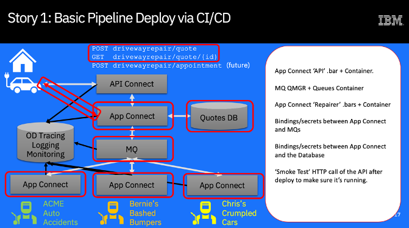

# Driveway Dent Deletion Demo
## Story 1: Deploy the Solution using a CI/CD pipeline

When integration components have been built and unit tested, we want to create container images for them and then deploy them all together using a deployment pipeline that deploys and configures all of the components automatically without manual intervention.

*(ToDo: Update this screenshot)*

Our solution consists of 4 App Connect integration flows, each as its own independent deployment/replica set, together with an MQ queue manager with a number of queues.

We are going to build 5 container images, one for each component and then deploy them all to the ICP4i runtime.

For the demo flow, we will assume that the Quotes Database already exists and is deployed somewhere in the enterprise. We will however set it up to run on OpenShift for this demo.

## Story Flow / List of Tasks
1. Create all of the CP4I Integration artefacts and place them into the github repo.

1. Create an OpenShift Pipeline and deploy that pipeline to CP4I. The pipeline will have tasks which can build, deploy and test our integration artefacts.

1. Create a WebHook which will detect when a change has been made to the github repository and start the pipeline to create a new build.

1. The pipeline will create container images for each of the integration artefacts then deploy the images to CP4i, ensuring that they are all correctly bound together.

1. The pipeline will then run automated tests to check that the deployed artefacts are deployed and functioning correctly.

## Demo Steps
These are the steps for running the demo - depending on your familiarity with things like git(hub), OpenShift and CP4I you may already have/know how to do some of these things. If that's the case, great - do it your preferred way - we'll tell you what you need to know.

## 1. Set up your CP4I Demo Environment
You'll need to get an instance of CP4I and set it up with the pre-requisites for running this demo. Details [here](../setupEnvironment.md)
