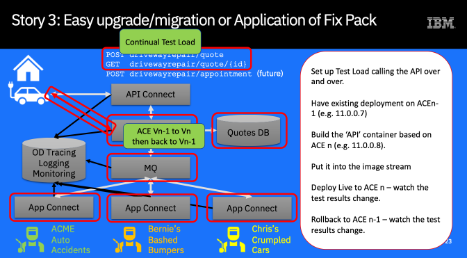

# Driveway Dent Deletion Demo
## Story 2: Show Automated Application Update (and Rollback) with a live system and zero downtime.

This Story is similar to Story 2 and uses the same approach – the only difference is that this time the container is built with a different App Connect base image, containing a different fixpack, rather than having a different .bar file.

In addition, this story demonstrates how CP4i can run multiple versions of the components (in this case App Connect) together, allowing users to upgrade their integrations independently and not as a ‘big bang’ update

## Why do I care?
“My integration runs on the IBM software version N-1. I want to upgrade to version N.

How do I upgrade just one integration without breaking anything else? How do I change Integration 2 without breaking integration 1?”

“How do I apply a fix pack on just this one integration and not my entire ESB?”

“If I apply a fixpack, can I roll back if I have problems?”

"How do I do all of this 'live' without needing downtime?"

## Approach

We are going to use the same pipeline as for [Story 2](../story2/README.md): The difference is that in this case, we are changing the version of the App Connect Software, not the integration logic (.bar file)

When we run the pipeline with the same .bar file, it will create a new container image but using a different version of App Connect to build the container from. As we will use a Kubernetes rolling update, the API will remain ‘live’ throughout the deployment and the new version will ‘roll over’ the previous one.

We will show this by using an automated test script which will keep a continuous load on the API so that you can see live service is maintained.

To roll back, we simply change the container back to the previous version and re-run the pipeline – again, the rollback is ‘live’.

## Story Flow / List of Tasks
1. Ensure that the integration solution from [Story1](../story1/README.md) is deployed and running.
1. Create continuous load on the solution to simulate live users accessing it. Ensure you can see calls and responses running.
1. Change the Dockerfile in git to use a different version of App Connect to build the container.
1. The change in git fires the webhook which starts the deployment Pipeline
1. Watch the pipeline build and deploy the new version of the integration.
1. During the deployment, keep watching the continuous test load: Note that there is no interruption of service. You won't be able to see any difference in the response, as the integration logic is the same
1. When the new version is deployed we may want to roll back to the original. Change the Dockerfile in github back to the original version of App Connect and commit.
1. The pipeline will run again and redeploy. Again, the continuous load will carry on running and you will see the update happen with no service interruption.
